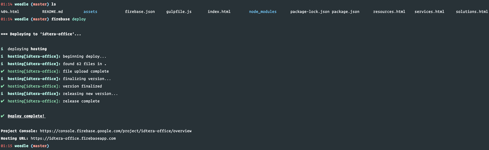

# 專案文件

# 設計概念

要呈現簡約、科技感，首先想到的是 [Material Design](https://material.io/design/)（為 Google 設計師提出的設計概念），再加上 [Twitter Bootstrap](https://getbootstrap.com/) 為基底，如此一來便可以同時擁有快速開發、簡約科技的雙重優點。

不可避免的，為了這個專案的需求，還是需要一些客製化調整，比方說調整顏色、標題上下空白、首頁大圖等等。不過有了 Bootstrap、Material Design 的基礎，我們將更容易客製化調整樣式。

# 伺服器簡介：Firebase Hosting

使用 Firebase Hosting 作為檔案伺服器，優點如下：

1. 自動化 HTTPS：無需自行管理憑證
2. SSD、CDN：在全球各地都能快速進入網站
3. 快速開發：使用 Firebase CLI（指令），即可快速上傳並更新網站
4. 版本控制：每次更新都會自動建立版本號，方便出現問題時，快速恢復到先前的版本
5. 可綁定網址：通過簡易的 DNS 設定，即可綁定自己的網址
6. 依流量、儲存量計費：無需額外負擔其它管理費用，用多少付多少

# 專案架構簡介

專案根目錄下面會有四個主要頁面檔案，其餘 CSS、JavaScript、圖檔，都統一在 assets 目錄下管理，如下所示：

## 四個主要頁面檔案

- `index.html`
- `services.html`
- `solutions.html`
- `resources.html`

## 主要樣式檔案

- `assets/css/material-kit.css`：此檔案為開源社群貢獻，基於 Bootstrap 設計的 CSS

## 主要圖檔

- `assets/img`

## 如何修改內容？

依照前面所述，四個頁面檔案分別落在 `index.html`、`services.html`、`solutions.html`、`resources.html` 四個 HTML 檔案中，各自完全獨立，所以如果需要修改 Footer，就必須四個檔案都修改。

## 如何修改樣式？

全部的樣式主要落在 `assets/css/material-kit.css` 裡面，如果需要修改的話，只要修改這個樣式檔案做客製化即可。

當然也可以自己建立一個新的 CSS 檔案，直接針對需要調整的樣式做覆蓋也是一個方法，使用這個方式時，需要分別在 `index.html`、`services.html`、`solutions.html`、`resources.html` 四個檔案的 `<head>` 最後面加上自己新建的 CSS 檔案。

# 修改後如何上傳至 Firebase Hosting？

主要教學可以參考 Google 文件：[https://firebase.google.com/docs/cli/](https://firebase.google.com/docs/cli/)

Node.js 為程式語言，NPM 是套件管理工具，Firebase CLI 是使用 Node.js 開發的工具，並上傳到 NPM 方便大家下載。

注意在參考 Google 文件時，可以省略初始化 Firebase 專案的步驟，因為我已經初始化完畢，所以在專案目錄中會有兩個檔案：`.firebaserc`（隱藏檔）、`firebase.json`。

## 首先，需要先在自己的電腦上安裝 Firebase CLI

因此安裝 Firebase CLI 步驟大致如下：

1. 安裝 Node.js、NPM
  1. Windows 參考文件：[https://www.liaoxuefeng.com/wiki/001434446689867b27157e896e74d51a89c25cc8b43bdb3000/00143450141843488beddae2a1044cab5acb5125baf0882000](https://www.liaoxuefeng.com/wiki/001434446689867b27157e896e74d51a89c25cc8b43bdb3000/00143450141843488beddae2a1044cab5acb5125baf0882000)
  2. Mac OS 參考文件：[https://cg2010studio.com/2016/07/08/node-mac-安裝-node-js/](https://cg2010studio.com/2016/07/08/node-mac-%E5%AE%89%E8%A3%9D-node-js/)
2. 透過 NPM 安裝 Firebase CLI（參考 Google 文件 Setup 的步驟）
  1. `npm install -g firebase-tools`
3. 使用 Firebase CLI 登入驗證你為專案的擁有人
  1. `firebase login`

注意：請確認 `firebase login` 沒有任何錯誤訊息（ERROR 字眼）。

## 修改完 HTML、CSS 等等檔案後，使用 Firebase CLI 上傳

上傳步驟：

1. 請在專案目錄下，使用 `firebase deploy` 即可完成。（Firebase CLI 會自動讀取 `.firebaserc`、`firebase.json` 完成上傳的動作）

注意：Firebase 會有快取，請多重新整理幾次，就會看到新的內容。

上傳成功畫面